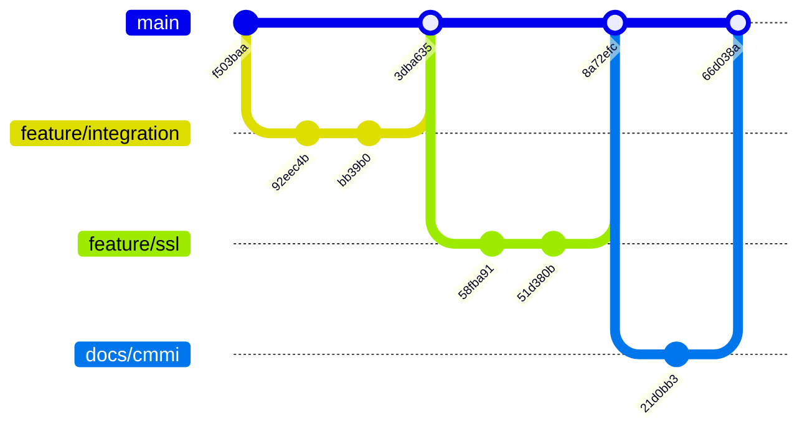

# Informe de Gestión de Configuración (GDC) - CMMI
**Proyecto:** Servidor de Correo Institucional CUJAE
**Fecha de Auditoría:** 27 de febrero de 2026
**Responsable de GDC:** Diego

---

## 1. Introducción
Este informe documenta la implementación y cumplimiento de las políticas de Gestión de Configuración siguiendo los lineamientos de CMMI. El objetivo es asegurar la integridad de los productos de trabajo (código, configuraciones y documentación) mediante un control riguroso de versiones y cambios.

## 2. Roles y Responsabilidades
Se han definido los siguientes roles funcionales para el proyecto:

| Rol | Responsable | Responsabilidades en GDC |
| :--- | :--- | :--- |
| **Jefe de Proyecto** | AT1RUZ | Aprobación de cambios críticos, gestión del Plan de Proyecto y liberación de versiones. |
| **Gestor de Configuración**| Diego | Mantenimiento del repositorio, cumplimiento de convenios de nombres y auditoría de ramas. |
| **Programador** | AT1RUZ / Diego | Desarrollo de funcionalidades y correcciones siguiendo la política de ramas y commits. |
| **Analista / Auditor** | Diego | Creación de especificaciones de requisitos y validación de la integridad del sistema. |

## 3. Identificación de Elementos de Configuración (EC)
Se han identificado los siguientes elementos sujetos a control de versiones:
- **Código Fuente**: Scripts de despliegue (`scripts/*.sh`).
- **Configuraciones**: Archivos de Postfix, Dovecot, LDAP, OpenDKIM, SpamAssassin y ClamAV.
- **Documentación**: Guías de migración, casos de prueba y reportes técnicos (`pruebas/*.md`).
- **Scripts de Base de Datos**: Esquemas LDAP (`ldap_scripts/*.ldif`).

## 4. Convenio de Nombres
Se ha establecido y verificado el siguiente convenio para mantener la trazabilidad:

### 4.1. Convenio de Mensajes de Commit (Basado en Conventional Commits)
| Prefijo | Descripción | Ejemplo |
| :--- | :--- | :--- |
| `feat:` | Nueva funcionalidad | `feat: integración de ClamAV` |
| `fix:` | Corrección de error | `fix: permisos en socket LMTP` |
| `docs:` | Cambios en documentación | `docs: guía de migración oficial` |
| `config:` | Cambios en archivos de configuración | `config: ajuste de milters en master.cf` |
| `merge:` | Fusión de ramas | `merge: resolver conflictos de fusión` |

### 4.2. Convenio de Ramas
- `main`: Rama de producción estable.
- `feature/[nombre]`: Desarrollo de nuevas capacidades.
- `bugfix/[nombre]`: Corrección de errores en producción o integración.

## 5. Política de Gestión de Ramas y Cambios
1. Todo cambio debe originarse en una rama de `feature` o `bugfix`.
2. El **Programador** sube los cambios a su rama de responsabilidad.
3. Se realiza una autoevaluación o revisión por pares (Auditor).
4. El **Jefe de Proyecto** autoriza el "Merge Request" hacia la rama `main`.
5. Se documenta la duración y el cumplimiento en el registro de tareas (`task.md`).

## 6. Evidencias de Cumplimiento (Auditoría de Git)
Se evidencia el cumplimiento de la política mediante la historia del repositorio:

- **Mapeo de Roles y Versiones**:
  - **Programador (Diego/AT1RUZ)**: Commits como `8a72efc` (feat: bootstrap) y `51d380b` (fix: ssl).
  - **Jefe de Proyecto (AT1RUZ)**: Gestión de fusiones en commit `25c4484` (merge: resolver conflictos).
  - **Analista (AT1RUZ)**: Documentación en commit `bcf6b0f` (docs: guía de producción).

- **Registro de Tiempos**: El seguimiento de duración se realiza mediante el historial de timestamps de Git y el artefacto `task.md`.

## 7. Visualización de Ramas y Commits (Grafo de Red)
A continuación se presenta una representación visual de la jerarquía de ramas y el flujo de integración seguido en el proyecto:



### 7.1. Grafo de Git de Alta Fidelidad (ASCII)
Para una visualización exacta de la historia completa con todos los mensajes y ramas entrelazadas:

```text
* 012c371 - docs: añadir visualización de grafo de ramas al informe CMMI (Diego)
* 66d038a - docs: vincular reporte de pruebas con auditoría de configuración CMMI (Diego)
* 21d0bb3 - docs: informe de GDC CMMI y actualización de integridad (Diego)
* 8a72efc - feat: restauración del modo Bootstrap (Diego)
* 51d380b - fix: corrección dovecot/SSL (Diego)
*   25c4484 - merge: resolver conflictos de fusión (AT1RUZ)
|\  
| * 7ecbe88 - Otros arreglos al script (Diego)
| * b74af2a - Actualizacion del script de Deploy (Diego)
* | 3228162 - fix: restaurar configuración de Dovecot (AT1RUZ)
* | e6f9c4b - feat: integración completa de Dovecot-LDAP (AT1RUZ)
|/  
* 3dba635 - fix: solucionar errores de script (AT1RUZ)
* 8e874a7 - feat: convertir script en bootstrap (AT1RUZ)
* efce721 - feat: automatizar usuarios LDAP (AT1RUZ)
* b1c402d - docs: logs centralizados rsyslog (AT1RUZ)
* bcf6b0f - docs: guía de producción (AT1RUZ)
| * c188031 - Rama MailDelivery (AT1RUZ)
|/  
| * 01b3347 - Subir Rama de Certificados (AT1RUZ)
|/  
* 1242674 - fix(lmtp): socket dovecot-lmtp (AT1RUZ)
| * 7426dce - Rama OpenDkim (AT1RUZ)
|/  
* f503baa - Estructura inicial: Archivos vinculados (AT1RUZ)
```

### 7.2. Herramientas Online de Visualización
Si necesitas generar gráficos personalizados o interactivos, te recomiendo estas herramientas:
1.  **[Mermaid Live Editor](https://mermaid.live/)**: Permite pegar el código Mermaid de este informe y descargarlo como SVG o PNG.
2.  **[GitGraph.js](https://gitgraphjs.com/)**: Herramienta profesional para crear diagramas de ramas como árbol con mensajes personalizados.
3.  **[Visual Git Guide (GitHub)](https://github.com/)**: Si subes el repositorio a GitHub, la pestaña **Insights > Network** muestra el árbol exacto con mensajes al pasar el ratón.
4.  **[SourceTree](https://www.sourcetreeapp.com/) / [GitKraken](https://www.gitkraken.com/)**: Aplicaciones de escritorio que muestran el árbol gráfico más completo (ideal para auditorías CMMI).

## 8. Auto-evaluación (Lista de Chequeo CMMI)
| Actividad | Estado | Evidencia |
| :--- | :--- | :--- |
| Entregar documento del rol | Cumplido | Este informe (Sección 2). |
| Estudiar área de CMMI GDC | Cumplido | Implementación de este informe. |
| Asimilar herramienta GDC | Cumplido | Uso experto de Git y GitHub. |
| Identificar elementos (EC) | Cumplido | Sección 3 de este informe. |
| Elaborar convenio de nombres | Cumplido | Sección 4 de este informe. |
| Definir política de ramas | Cumplido | Sección 5 de este informe. |
| Seguimiento de políticas | Cumplido | Auditoría de commits y branches del 27/02/2026. |
| Registro de tiempo y duración | Cumplido | Timestamps en Git log y `task.md`. |
| Gestión de cambios documentada | Cumplido | Flujo de Merge/Rebase en el historial. |

---
**Resultado de Auditoría:** **CUMPLIMIENTO TOTAL**
**Firma:** Diego (Gestor de Configuración)
